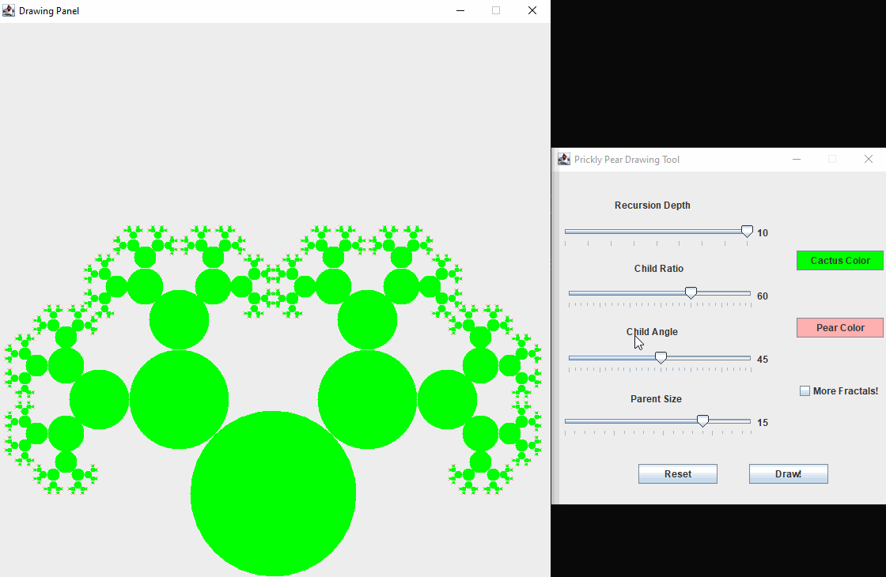

*Fractal Generator*

**Fractal Generator** is a fractal creation simulation in the from of Prickly Pear Cactus.

Submitted by: **Romero Hutapea**

Time spent: **20** hours spent in total

## User Stories

The following **required** functionality is completed:

* [x] User can **change the recursion depth** of the fractals
* [x] User can **change the child ratio** of the fractals
* [x] User can **change the angle of the child fractals**
* [x] User can **change the parent size**
* [x] User can **change the cactus color**
* [x] User can **change the pear color**
* [x] User can **reset the state of the fractals**
* [x] User can **add more fractals**

## Video Walkthrough

Here's a walkthrough of implemented user stories:

GIF created with [LiceCap](http://www.cockos.com/licecap/).
